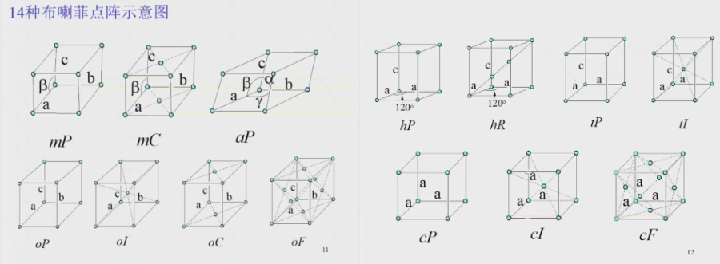
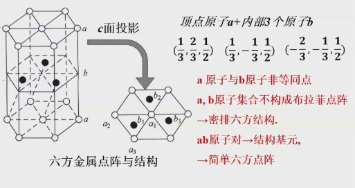
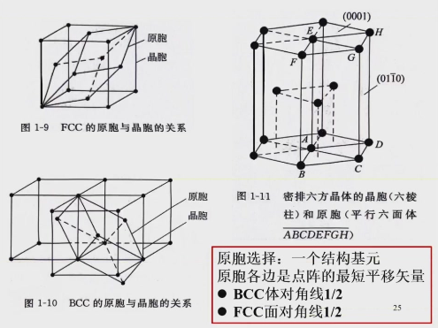

# 材科基 I · 晶体学部分

## 材料的分类

### 按成分分：
- 金属材料
- 无机非金属材料
- 有机材料

### 按结构分：
- **晶体**：长程有序，有平移周期性
- **非晶体**：短程有序，无定形体，玻璃态
- **准晶体**：长程有序，无平移周期性，有准周期性

## 晶体的五个性质：

- **自范性**：晶体生长过程中具有自发形成封闭几何多面体的现象，体现内部原子规则性排列。
- **各向异性**：不同方向上原子排列情况不同导致磁、热、光等性质不同。
- **均一性**：晶体各部分的物理性质与化学性质相同。
- **对称性**：在晶体相同部分或性质在不同的方向或位置上做有规律的重复（**经过对称操作物体可以在新的位置上和原先的自身重合**）。
- **稳定性**：晶态相比其他物态，内能最小，最为稳定。
- **晶体的根本特征：内部结构的周期性**

## 空间点阵
### 基本概念
- **空间点阵**：将内部周期性抽象成数学图形。
- **阵点/结点**：空间点阵中的每个几何点。
- **基矢（晶轴）**：确定晶胞大小的矢量。基矢的大小叫**晶格常数**。
- **结构基元（等同点）**：**化学组成**相同、**空间结构**相同、**排列取向**相同、**周围环境**相同。其中晶胞中含**一个**结构基元的为**素晶胞**（即**原胞**），含**两个及以上**的为**复晶胞**。
- **空间点阵+结构基元=晶体结构**
 
### 七大晶系与14种布喇菲点阵
- **晶系**：根据 **a、b、c** 三个晶格常数之间的相等关系，以及 **α、β、γ** 三个晶轴间夹角的关系，把空间点阵划分成的类别，共**7**种。
- **布喇菲点阵**：按晶体点阵的**有心方式**分类，可分为**14**种布喇菲点阵。
 

| 符号  | 晶系  |          点阵常数           |      独立点阵常数      |             布喇菲点阵类型             |
| :-: | :-: | :---------------------: | :--------------: | :-----------------------------: |
|  a  | 三斜  |    a≠b≠c, α≠β≠γ≠90°     | a, b, c, α, β, γ |             简单 (aP)             |
|  m  | 单斜  |    a≠b≠c, α=γ=90°<β     |    a, b, c, β    |         简单 (mP)；底心 (mC)         |
|  o  | 正交  |   a ≠ b≠c, α =β=γ=90°   |     a, b, c      | 简单 (oP)；底心 (oC)；体心 (oI)；面心 (oF) |
|  t  | 四方  |    a=b≠c, α=β=γ=90°     |       a, c       |         简单 (tP)；体心 (tI)         |
| hr  | 菱面体 |  a=b=c, α=β=γ≠90°<120°  |       a, α       |            菱面体 (hR)             |
|  h  | 六角  | a=b≠ c, α=β=90°, γ=120° |       a, c       |             简单 (hP)             |
|  c  | 立方  |    a=b=c, α=β=γ= 90°    |        a         |     简单 (cP)；体心 (cI)；面心 (cF)     |

符号对照：

- `a`= triclinic 三斜、`m`= monoclinic 单斜、`o`= orthorhombic 正交、
- `t`= tetragonal 四方、`hr`= rhombohedral 菱面体、`h`= hexagonal 六角、
- `c`=cubic 立方
- P=简单、I=体心、F=面心、A/B/C=底心 

## 复式点阵、晶胞和惯用晶胞选取原则
###  **复式点阵**
- **复式点阵**：多个布喇菲点阵穿插而成的复杂点阵。

### 晶胞
- **晶胞**：能完整反应晶体内部原子或离子在三维空间分布的**化学结构特征**的**平行六面体单元**。其中既能够保持**晶体结构的对称性**而**体积又最小**的为**单位晶胞**，也简称**晶胞**。

### 惯用晶胞选取原则
- **惯用晶胞**：选择对称性高的对称轴为坐标轴以能直观反映晶体对称性的平行六面体作为晶胞，叫惯用晶胞。
- **惯用晶胞选取原则**：
	- 1.反映晶体的宏观对称性；
	- 2.尽可能多的直角；
	- 3.相等的棱边和夹角尽可能多；
	- 4.满足上述条件下，体积最小。

## 晶体取向表示方法
### 解析法
#### 晶向、晶面和指数
- **晶向**：晶体中任意两个阵点或原子之间的连线——晶向指数，线指数[uvw]。其中uvw须化为最简整数比。
- **晶面**：晶体中由一系列阵点或原子构成的平面——晶面指数，米勒指数(hkl)。其中hkl为三截距取倒数并须化为最简整数比。
- **指数**：阵点坐标，[ [ xyz ] ]，不可化简。

#### 晶面族和晶向族
- **晶向族**：晶体的等同方向，表示为 ⟨uvw⟩。
- **晶面族**：晶体的等价晶面，表示为{hkl}。
- **立方**：改变uvw或hkl的顺序、正负号。
- **四方**：改变uv或hk的顺序、正负号，改变w或l正负号。
- **正交**：改变uvw或hkl正负号。
- **单斜**：改变v或k正负号。
- **三斜**：无。

#### 四指数表示（六方晶系）
- **晶面四指数**：(hkil)，其中i=-(h+k)
- **晶向四指数**：密勒指数为[UVW]，布喇菲-密勒指数[uvtw]的关系为：

$$
\begin{aligned}
&U=2u+v\\
&V=u+2v\\
&W=w\\
\\
&u=\frac{1}{3}(2U-V)\\
&v=\frac{1}{3}(2V-U)\\
&t=-\frac{1}{3}(U+V)\\
&w=W
\end{aligned}
$$
