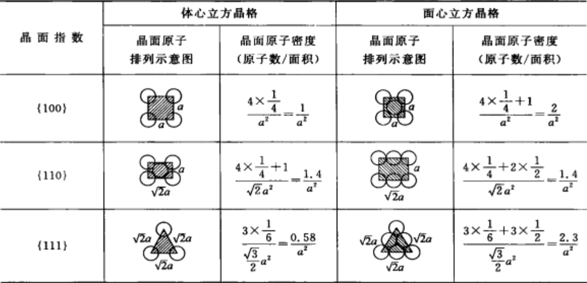
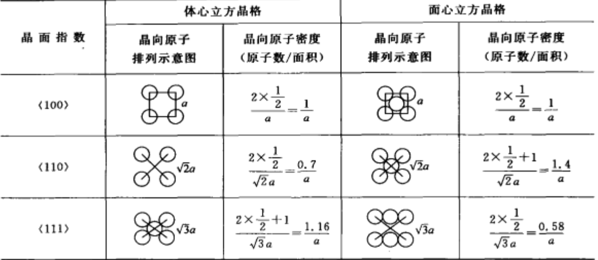
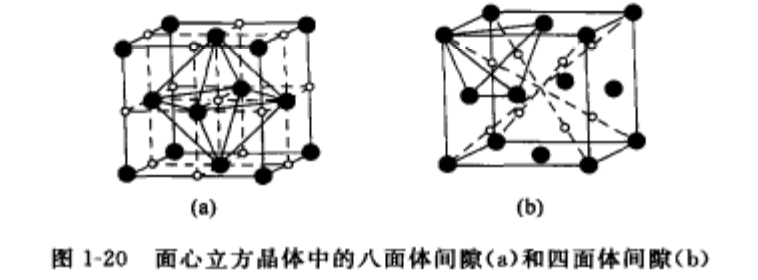
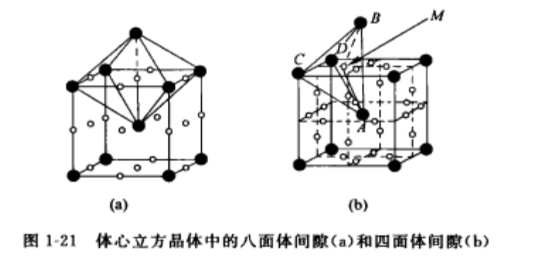
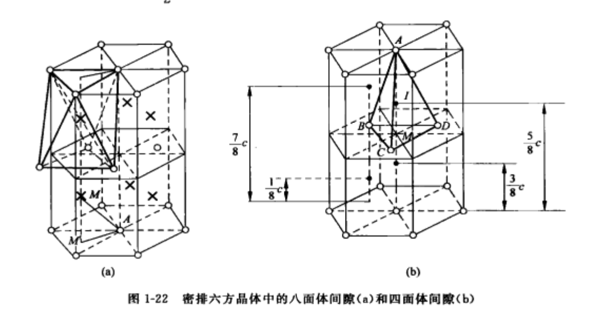

# 材料科学基础I 晶体学
## 材料的分类

### 按成分分：
- 金属材料
- 无机非金属材料
- 有机材料

### 按结构分：
- **晶体**：长程有序，有平移周期性
- **非晶体**：短程有序，无定形体，玻璃态
- **准晶体**：长程有序，无平移周期性，有准周期性

## 晶体的五个性质：

- **自范性**：晶体生长过程中具有自发形成封闭几何多面体的现象，体现内部原子规则性排列。
- **各向异性**：不同方向上原子排列情况不同导致磁、热、光等性质不同。
- **均一性**：晶体各部分的物理性质与化学性质相同。
- **对称性**：在晶体相同部分或性质在不同的方向或位置上做有规律的重复（**经过对称操作物体可以在新的位置上和原先的自身重合**）。
- **稳定性**：晶态相比其他物态，内能最小，最为稳定。
- **晶体的根本特征：内部结构的周期性**

## 空间点阵
### 基本概念
- **空间点阵**：将内部周期性抽象成数学图形。
- **阵点/结点**：空间点阵中的每个几何点。
- **基矢（晶轴）**：确定晶胞大小的矢量。基矢的大小叫**晶格常数**。
- **结构基元（等同点）**：**化学组成**相同、**空间结构**相同、**排列取向**相同、**周围环境**相同。其中晶胞中含**一个**结构基元的为**素晶胞**（即**原胞**），含**两个及以上**的为**复晶胞**。
- **空间点阵+结构基元=晶体结构**

### 七大晶系与14种布喇菲点阵
- **晶系**：根据 **a、b、c** 三个晶格常数之间的相等关系，以及 **α、β、γ** 三个晶轴间夹角的关系，把空间点阵划分成的类别，共**7**种。
- **布喇菲点阵**：按晶体点阵的**有心方式**分类，可分为**14**种布喇菲点阵。

| 符号  | 晶系  |          点阵常数           |      独立点阵常数      |             布喇菲点阵类型             |
| :-: | :-: | :---------------------: | :--------------: | :-----------------------------: |
|  a  | 三斜  |    a≠b≠c, α≠β≠γ≠90°     | a, b, c, α, β, γ |             简单 (aP)             |
|  m  | 单斜  |    a≠b≠c, α=γ=90°<β     |    a, b, c, β    |         简单 (mP)；底心 (mC)         |
|  o  | 正交  |   a ≠ b≠c, α =β=γ=90°   |     a, b, c      | 简单 (oP)；底心 (oC)；体心 (oI)；面心 (oF) |
|  t  | 四方  |    a=b≠c, α=β=γ=90°     |       a, c       |         简单 (tP)；体心 (tI)         |
| hr  | 菱面体 |  a=b=c, α=β=γ≠90°<120°  |       a, α       |            菱面体 (hR)             |
|  h  | 六角  | a=b≠ c, α=β=90°, γ=120° |       a, c       |             简单 (hP)             |
|  c  | 立方  |    a=b=c, α=β=γ= 90°    |        a         |     简单 (cP)；体心 (cI)；面心 (cF)     |

符号对照：

- `a`= triclinic 三斜、`m`= monoclinic 单斜、`o`= orthorhombic 正交、
- `t`= tetragonal 四方、`hr`= rhombohedral 菱面体、`h`= hexagonal 六角、
- `c`=cubic 立方
- P=简单、I=体心、F=面心、A/B/C=底心

## 复式点阵、晶胞和惯用晶胞选取原则
###  **复式点阵**
- **复式点阵**：多个布喇菲点阵穿插而成的复杂点阵。

### 晶胞
- **晶胞**：能完整反应晶体内部原子或离子在三维空间分布的**化学结构特征**的**平行六面体单元**。其中既能够保持**晶体结构的对称性**而**体积又最小**的为**单位晶胞**，也简称**晶胞**。

### 惯用晶胞选取原则
- **惯用晶胞**：选择对称性高的对称轴为坐标轴以能直观反映晶体对称性的平行六面体作为晶胞，叫惯用晶胞。
- **惯用晶胞选取原则**：
	- 1.反映晶体的宏观对称性；
	- 2.尽可能多的直角；
	- 3.相等的棱边和夹角尽可能多；
	- 4.满足上述条件下，体积最小。

## 晶体取向表示方法
### 解析法
#### 晶向、晶面和指数
- **晶向**：晶体中任意两个阵点或原子之间的连线——晶向指数，线指数$[uvw]$。其中$uvw$须化为最简整数比。
- **晶面**：晶体中由一系列阵点或原子构成的平面——晶面指数，米勒指数$(hkl)$。其中$hkl$为三截距取倒数并须化为最简整数比。
- **指数**：阵点坐标，$[[xyz]]$，不可化简。

#### 晶面族和晶向族
- **晶向族**：晶体的等同方向，表示为$⟨uvw⟩$ 。
- **晶面族**：晶体的等价晶面，表示为{${hkl}$}。
- **立方**：改变$uvw$或$hkl$的顺序、正负号。
- **四方**：改变$uv$或$hk$的顺序、正负号，改变$w$或$l$正负号。
- **正交**：改变$uvw$或$hkl$正负号。
- **单斜**：改变$v$或$k$正负号。
- **三斜**：无。

#### 四指数表示（六方晶系）
- **晶面四指数**：$(hkil)$，其中 $i=\overline{h+k}$
- **晶向四指数**：密勒指数为$[UVW]$，布喇菲-密勒指数$[uvtw]$的关系为：

$$
\begin{aligned}
&U=2u+v\\
&V=u+2v\\
&W=w\\
\\
&u=\frac{1}{3}(2U-V)\\
&v=\frac{1}{3}(2V-U)\\
&t=-\frac{1}{3}(U+V)\\
&w=W
\end{aligned}
$$

#### 立方和六方晶体中重要晶向的快速标注
- **立方晶体**：$⟨100⟩$为晶轴；$⟨110⟩$为面对角线；$⟨111⟩$为体对角线；$⟨112⟩$为顶点到对面的面心连线。
- **六方晶体**：$[0001]$为c轴；$⟨2\bar{1}\bar{1}0⟩$为和三个$a$轴平行的晶向；$⟨10\bar{1}0⟩$为两个晶轴$a_i$和$a_j$的角平分线；不平行于基面的晶向，先求在基面投影向量，再加上$w$即可。

#### 常见晶体的几何特征、主要晶面及晶向的原子排列方式和排列密度
##### 常见晶体的几何特征
- 配位数 $CN$：一个原子周围的最近邻原子数。
- $n$：一个晶胞内原子数。
- $r$：原子半径（硬球模型中的球半径）。
- $v$：单个原子的体积，$v=\dfrac{4}{3}\pi r^3$。
- $V$：晶胞体积。
- 紧密系数 $\xi$：硬球模型中的堆垛密度，等于晶胞中所有原子的体积之和除以晶胞体积，即 $\xi=\dfrac{nv}{V}$。
- **致密有序堆叠能量最低**。

| 晶体 | $CN$ | $n$ | $r$ | $v$ | $V$ | $\xi$ |
| :-: | :-: | :-: | :-: | :-: | :-: | :-: |
| BCC | 8 | 2 | $\frac{\sqrt{3}a}{4}$ | $\frac{\sqrt{3}\pi a^3}{16}$ | $a^3$ | $0.68$ |
| FCC | 12 | 4 | $\frac{\sqrt{2}a}{4}$ | $\frac{\sqrt{2}\pi a^3}{24}$ | $a^3$ | $0.74$ |
| HCP | 12 | 6 | $\frac{a}{2}$ | $\frac{\pi a^3}{6}$ | $\frac{3\sqrt{3}}{2}\bigl(\frac{c}{a}\bigr)a^3$ | $0.74$ |

注：HCP 的 $\xi=0.74$ 是按理想轴比 $c/a=\sqrt{8/3}\approx1.633$ 算出的；实际 $c/a$ 偏离理想值时 $\xi=\frac{2\pi}{3\sqrt{3}}\cdot\frac{a}{c}$ 会随之变化。

##### 体心立方、面心立方晶格的主要晶面的原子排列方式和排列密度
- **密排面**：原子密度最大的晶面。如BCC中密排面为{${110}$}，FCC中密排面为{${111}$}，HCP中密排面为{${0001}$}。

##### 体心立方、面心立方晶格的主要晶向的原子排列方式和排列密度
- **密排方向**：原子密度最大的晶向。如BCC中密排方向为$⟨111⟩$，FCC中密排方向为$⟨110⟩$，HCP中密排方向为$⟨11\bar{2}0⟩$。

##### 补充

|          |              面心立方FCC              |           体心立方BCC           |                                                         密排六方HCP                                                         |
| :------: | :-------------------------------: | :-------------------------: | :---------------------------------------------------------------------------------------------------------------------: |
|  密排面间距   |       $\frac{\sqrt{3}}{3}a$       |    $\frac{\sqrt{2}}{2}a$    |                                                     $\frac{1}{2}c$                                                      |
| 密排方向最小单位 |       $\frac{\sqrt{2}}{2}a$       |    $\frac{\sqrt{3}}{2}a$    |                                                           $a$                                                           |
|   常见金属   | Al、$\gamma$-Fe、Ni、Pb、Pd、Pt、奥氏体不锈钢 | V、Nb、Ta、Cr、Mo、W、$\alpha$-Fe | $\alpha$-Be ($c/a=1.57$)、$\alpha$-Ti、$\alpha$-Zr、$\alpha$-Hf ($1.59$)、$\alpha$-Co 及 Mg ($1.62$)、Zn ($1.86$)、Cd ($1.89$) |

#### 常见晶体结构中的重要间隙
##### FCC、BCC、HCP的八面体间隙和四面体间隙

| 晶体结构 | 八面体间隙数/原子数 | 八面体 $r_x/r$ | 四面体间隙数/原子数 | 四面体 $r_x/r$ |
| :--: | :--------: | :---------: | :--------: | :---------: |
| BCC  |     3      |    0.155    |     6      |    0.291    |
| FCC  |     1      |    0.414    |     2      |    0.225    |
| HCP  |     1      |    0.414    |     2      |    0.225    |

注：$r_x/r$ 为间隙半径与基体原子半径之比，即该间隙能容纳的最大刚性球半径与原子半径之比。

1. 原子半径较小的间隙式元素在FCC及HCP金属中扩散速率$<$BCC。
2. FCC和HCP金属中间隙原子多位于**八面体间隙**。
3. BCC中间隙原子多位于**四面体间隙**。
4. FCC和HCP的八面体间隙远大于BCC八面体或四面体间隙，间隙元素在FCC和HCP中的溶解度大于BCC。
5. FCC和HCP几何特征基本一致由堆垛方式决定。

##### 补充图

#### 晶体的堆垛方式

|      |   FCC   |   BCC   |   HCP    |
| :--: | :-----: | :-----: | :------: |
| 堆垛方式 | ABCABC  |  ABAB   |   ABAB   |
| 堆垛方向 | $⟨111⟩$ | $⟨110⟩$ | $⟨0001⟩$ |

### 投影法
略

## 倒易点阵
